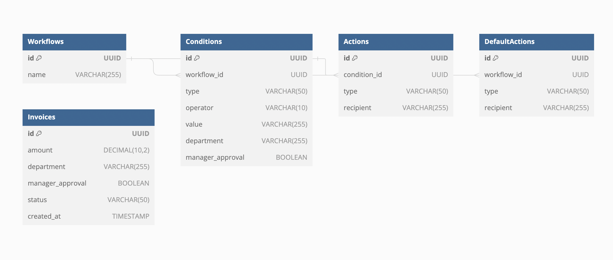

# Approval workflow challenge

This project is MVP application designed to implement an invoice approval workflow. The decision-making process for sending approval requests can be based on the invoice amount, the department the invoice is sent to, and whether manager approval is required. The application is built using Node.js, Express, React and TypeScript.

The Backend was built in Node and Typescript for time management purpose, as I am currently refreshing my Java ;)

For simplicity, we used in-memory and simple data model

# Project Structure

Backend :

- controllers: Contains the logic for handling incoming requests and sending responses back to the client
- models: Defines the simple data structures and schema for the application. This is where the in-memory representation of the workflow is defined.
- routes: Contains the route definitions and maps HTTP endpoints
- services: mplements the business logic and core functionalities for the workflow process.
- types: grouping all types used
- server.ts: simple Express backend server

Frontend:

- components: resuable components (invoice form)
- pages/api/approve.ts: API route for approving invoices, serverless interaction with backend
- index.ts: main app page
- services: cleint side API routes
- utils: utility functions for input validation

### Real world scenario updates:

In a real world scenario we would:

- Define more type for departments
- Connect APi to third party tools
-

### How to build & run

## Backend

```sh
cd backend
npm install
npm run dev
```

## Frontend

```sh
cd frontend
npm install
npm run dev
```

Database Model :

